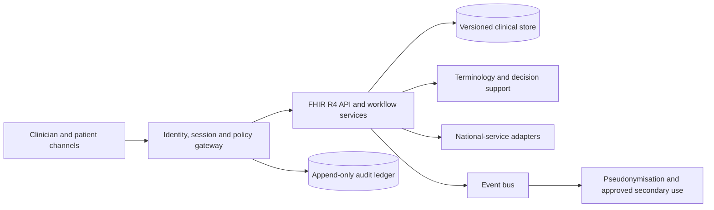

# Target architecture

## Responsibilities

| Layer | Responsibility |
|---|---|
| Channels | Accessible clinician workspace, patient portal and embedded SMART applications |
| Identity and policy | Federated SSO, MFA, short sessions, RBAC plus ABAC, consent/block enforcement and emergency access |
| Clinical platform | Documentation, orders, referrals, results, medication workflows and signing |
| Interoperability | FHIR R4 with Swedish profiles, validation, terminology resolution and versioned contracts |
| Data | Transactional clinical records, immutable versions, encrypted objects and a separate audit domain |
| Integration | Adapters for national and regional services so external contracts do not leak into the clinical core |
| Secondary use | Purpose-approved, pseudonymised exports into isolated analysis environments |

## Operational qualities

- Active-active service deployment across two Swedish or EU availability zones
- Tested recovery objectives and a degraded read-only mode for major incidents
- End-to-end observability using clinical-workflow service-level objectives
- Software bills of materials, signed builds and policy-controlled delivery
- Contract and schema testing for every integration boundary
- Open export formats and rehearsed supplier-exit procedures
