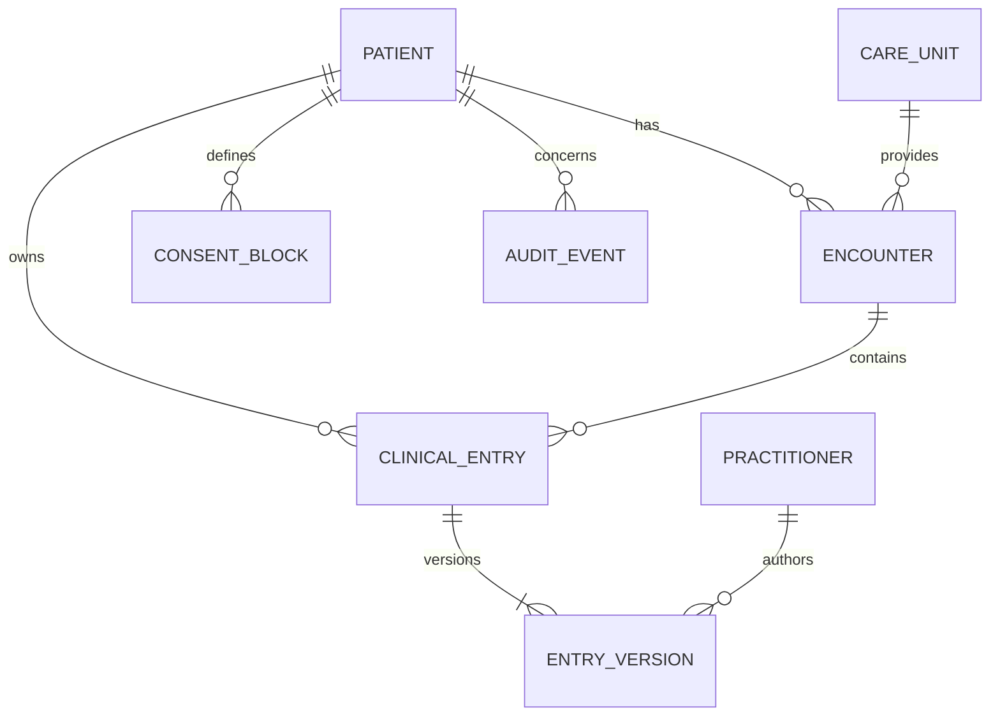

# Canonical data model

## Core entities

| Entity | Key fields | Purpose |
|---|---|---|
| Patient | `patient_id`, encrypted national identifier, birth date, administrative gender, version | Stable clinical subject separated from direct identifiers |
| Encounter | `encounter_id`, patient, care unit, status, class, period and reason | Clinical contact context |
| ClinicalEntry | `entry_id`, patient, encounter, resource type and clinical status | Stable identity of a clinical record |
| EntryVersion | `version_id`, entry, author, signed time, superseded version and payload hash | Immutable history of authoring, correction and signing |
| Practitioner | `practitioner_id`, HSA identifier, licence type and active status | Staff identity and professional qualification |
| CareUnit | `care_unit_id`, HSA identifier, provider organisation and name | Organisational context |
| ConsentBlock | `directive_id`, patient, scope, purpose, period and state | Consent, restriction and patient block directives |
| AuditEvent | `event_id`, actor, patient, action, purpose, resource, decision and time | Append-only record of every sensitive read and write |

## FHIR mapping

The API layer maps the canonical core to FHIR R4 resources such as `Patient`, `Encounter`, `Composition`, `DocumentReference`, `Observation`, `Condition`, `AllergyIntolerance`, `MedicationRequest`, `Consent`, `Provenance` and `AuditEvent`. Profiles and terminology bindings are versioned independently from stored clinical history.

Binary files live in encrypted object storage and are addressed through immutable `DocumentReference` metadata. Corrections create a new `EntryVersion`; they never overwrite signed history.
